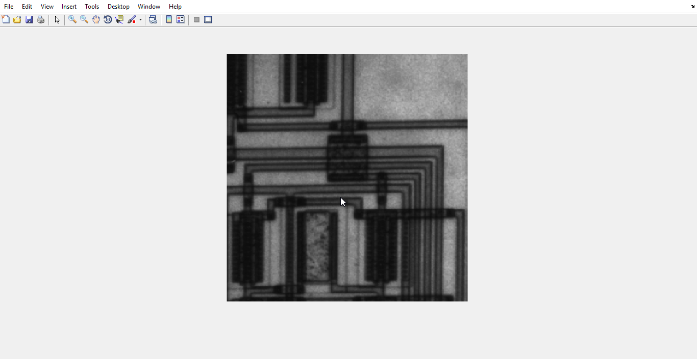
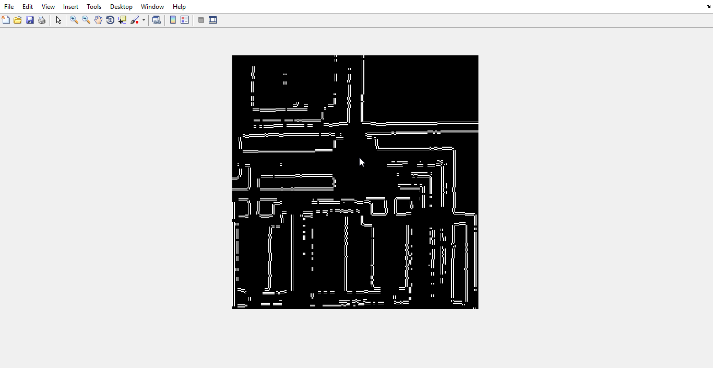

#Edge detection

### Matlab Code : 
``` matlab
I = imread('circuit.tif');
J = edge(I);
figure;
imshow(I); 
firstDev = edge(J, 'prewitt');
figure;
imshow(firstDev);
secondDev = edge(J, 'log');
figure;
imshow(secondDev); 
cannyAlg = edge(J, 'canny');
figure;
imshow(cannyAlg);
```

#### original Photo

#### Edge detection with first derivative: 
 
#### Edge detection using  Second derivative : 


#### Edge detection using canny algorithm: 

I think edge detection using canny algorithm can give us a better result 
